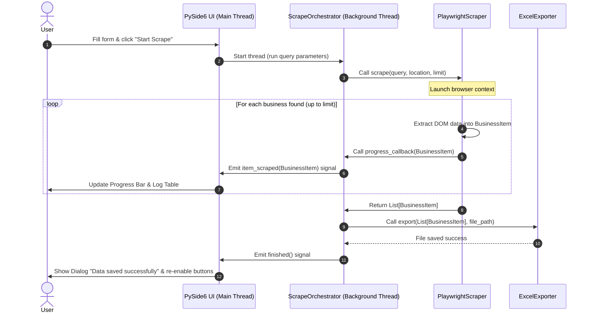

# Architectural Design Document: GeoScrape

## 1. Introduction
This document outlines the architecture for **GeoScrape**, a desktop RPA application built in Python. The design adheres strictly to the **SOLID principles** and divides responsibilities across distinct modules to ensure scalability, ease of maintenance, and testability. This modularity is particularly suited for academic presentation, showing a clean separation between GUI rendering, scraping/automation, and file output.

---

## 2. SOLID Alignment

- **Single Responsibility Principle (SRP)**: Each class has exactly one reason to change. The GUI is only responsible for presentation; the scraper is only responsible for browser automation and parsing; the exporter is only responsible for Excel writing.
- **Open/Closed Principle (OCP)**: Code is open for extension but closed for modification. By utilizing interfaces (abstract base classes) for both scraping and exporting, new scraper backends (e.g., Google Places API) or export formats (e.g., CSV, JSON, Database) can be added without modifying the Core Orchestrator.
- **Liskov Substitution Principle (LSP)**: Subclasses implementing `ScraperInterface` or `ExporterInterface` can be substituted seamlessly without breaking the system.
- **Interface Segregation Principle (ISP)**: Interfaces are kept highly specific. Clients only depend on methods they actually use (e.g., `ScraperInterface` defines a simple, single method for executing a scrape).
- **Dependency Inversion Principle (DIP)**: High-level business logic (the orchestrator) depends on abstract interfaces (`ScraperInterface`, `ExporterInterface`) rather than concrete implementations (`PlaywrightScraper`, `ExcelExporter`).

---

## 3. Directory & Folder Structure

```text
geoscrape/
│
├── src/
│   ├── __init__.py
│   ├── main.py                 # Application launcher and DI bootstrapper
│   │
│   ├── core/                   # Core Domain Logic & Abstractions
│   │   ├── __init__.py
│   │   ├── models.py           # Domain data structures (e.g., BusinessItem)
│   │   ├── interfaces/         # Abstract Base Classes (Contracts)
│   │   │   ├── scraper.py      # Abstract ScraperInterface
│   │   │   └── exporter.py     # Abstract ExporterInterface
│   │   └── orchestrator.py     # Background worker orchestrating state & flow
│   │
│   ├── ui/                     # Presentation Layer (PySide6)
│   │   ├── __init__.py
│   │   ├── main_window.py      # Main dashboard interface
│   │   └── components/         # Reusable widgets
│   │       ├── config_form.py  # User search parameters input form
│   │       ├── log_console.py  # Live progress logs display
│   │       └── control_panel.py# Scraping run/stop controls
│   │
│   ├── scraper/                # RPA Scraper Layer (Playwright)
│   │   ├── __init__.py
│   │   ├── playwright_scraper.py # PlaywrightScraper implementation
│   │   └── selectors.py        # CSS/XPath selectors dictionary
│   │
│   └── exporter/               # File Export Layer (openpyxl)
│       ├── __init__.py
│       └── excel_exporter.py   # ExcelExporter implementation
│
├── tests/                      # Automated Test Suite
│   ├── __init__.py
│   ├── test_scraper.py         # Mock tests for scraper logic
│   └── test_exporter.py        # Tests for spreadsheet writing
│
├── requirements.txt            # Project dependencies
└── README.md
```

---

## 4. Module Responsibilities

### 4.1 Entry Point (`src/main.py`)
- Initializes the PySide6 `QApplication`.
- Performs **Dependency Injection (DI)** by instantiating the concrete dependencies (`PlaywrightScraper`, `ExcelExporter`) and passing them to the high-level `Orchestrator`.
- Displays the `MainWindow` and handles the application exit cycle.

### 4.2 Core Layer (`src/core/`)
- **`models.py`**:
  - Contains immutable data models representing scraped business information (e.g., a frozen Python `dataclass` named `BusinessItem`).
- **`interfaces/scraper.py`**:
  - Defines `ScraperInterface` (Abstract Base Class).
  - Exposes `scrape(query: str, location: str, limit: int, callback: Callable[[BusinessItem], None]) -> List[BusinessItem]`.
- **`interfaces/exporter.py`**:
  - Defines `ExporterInterface` (Abstract Base Class).
  - Exposes `export(items: List[BusinessItem], file_path: str) -> None`.
- **`orchestrator.py`**:
  - Contains `ScrapeOrchestrator` which inherits from PySide6's `QThread`.
  - Runs the scraper on a separate background thread to keep the PySide6 GUI responsive.
  - Implements the main state machine (Idle, Running, Cancelling, Complete).
  - Connects scraper progress events to custom Qt Signals (e.g., `item_scraped`, `progress_changed`, `finished`, `failed`) to communicate safely across thread boundaries.

### 4.3 UI Layer (`src/ui/`)
- **`main_window.py`**:
  - Composes individual components into a single dashboard.
  - Connects button clicks to `ScrapeOrchestrator` start/stop controls.
- **`components/config_form.py`**: Handles form inputs, validates fields (e.g., ensuring search limits are positive integers), and blocks modification while a scrape is in progress.
- **`components/log_console.py`**: Renders real-time extraction logs and displays progress percentages.

### 4.4 Scraper Engine (`src/scraper/`)
- **`playwright_scraper.py`**:
  - Implements `ScraperInterface`.
  - Houses all Playwright browser interactions: launching, navigating to Google Maps, dynamic list scrolling, and page DOM parsing.
  - Runs in either headless (fast, background) or headed mode (visible browser window).
- **`selectors.py`**:
  - Isolates CSS/XPath selectors. Keeping selectors external to class code makes repairing the application straightforward when Google changes its DOM structure.

### 4.5 Exporter Engine (`src/exporter/`)
- **`excel_exporter.py`**:
  - Implements `ExporterInterface`.
  - Receives the raw dataset and uses `openpyxl` to write records into columns.
  - Formats headers (bold text, background colors) and applies auto-fitting for column widths.

---

## 5. Data Flow Diagram



---

## 6. Error Handling Strategy

To prevent application crashes and provide clear user feedback, the app implements a layered error handling structure:

1. **DOM Extraction Exceptions (Non-Fatal)**:
   - If a specific selector (e.g., website URL or phone number) fails to load or parse, the scraper catches the exception locally, logs a debug warning, assigns a placeholder value (`"N/A"`), and continues.
2. **Network/Scraper Connection Failure (Fatal)**:
   - Major network drops or failure to launch Playwright browsers raise a custom `ScraperConnectionError`.
   - The Scraper catches this, closes the browser context, and bubbles the exception to the `Orchestrator`.
3. **Write / OS Permissions (Fatal)**:
   - Attempting to export to a file that is locked (e.g., open in Microsoft Excel) raises a custom `ExporterWriteError`.
   - The Exporter bubbles this to the `Orchestrator`.
4. **Thread Boundary Exception Handling**:
   - The Orchestrator wraps its execution loop in a standard `try-except` block.
   - If any fatal exception propagates to the orchestrator thread, it catches it and emits the Qt signal `failed(str)` containing the error message.
   - The GUI thread catches this signal and pops up a clear, user-friendly `QMessageBox` error alert.

---

## 7. Logging Strategy

Logging serves two distinct targets: developers (debugging) and users (progress tracking). We implement a **Dual-Handler Logger**:

### 7.1 System Logger (File and Console)
Using Python's standard `logging` library, all logs are routed to a local rotating file (`geoscrape.log`) and standard output.
- `DEBUG`: Web elements inspected, scroll pixel positions, browser configuration details.
- `INFO`: Scraper start/stop events, browser initialization, successful file writes.
- `WARNING`: Elements that timed out but were recovered, non-critical extraction failures (e.g., "Phone number missing for Business X").
- `ERROR`: Playwright connection issues, lock issues with Excel sheets, critical DOM changes.

### 7.2 UI Log Console Handler
- A custom `logging.Handler` implementation (e.g., `QtLogHandler`) intercepts application logs at the `INFO` and `WARNING` levels.
- It translates these logs into Qt signals and forwards them to the UI's scrollable log console widget.
- This ensures the UI displays clean, user-friendly messages (e.g., *"Scraping: Dentist #4 in Chicago..."*) without cluttering the screen with detailed stack traces or debug info.
